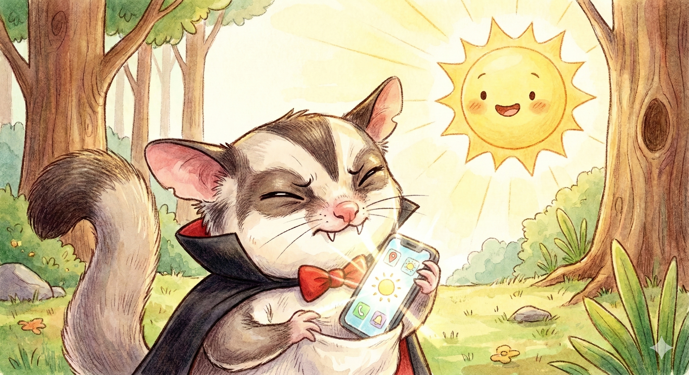

# 🦇 Dracula Survival App ― モモンガドラキュラの生存記録



**「ただのフクロモモンガ」から「真祖」へ ― 闇の中にのみ、我は生きる**

フクロモモンガのドラキュラが主人公の、リアル連動サバイバルゲームです。
紫外線をリアルタイムで計測し、外出を最小限に抑えながらヴァンパイアポイントを積み重ね、ランクアップを目指しましょう。

ニンニクを食べてしまったら懺悔の間へ。トマトジュースで贖罪できます。

## ✨ Features

### 🏰 ランクシステム

ヴァンパイアスタンプ (pts) を貯めて、ドラキュラとして覚醒していく育成システム。

| ランク | 称号 | 必要pts | 説明 |
|:------:|:-----|:-------:|:-----|
|  | **Just a Sugar Glider**<br>ただのフクロモモンガ | 0〜9 | 人語を話せない。日光で即座に消滅する。 |
|  | **Baby Dracula**<br>赤ちゃんドラキュラ | 10〜24 | 牙が生え始めている。「日焼け止め」ミルクが必要。 |
|  | **Dark Knight**<br>闇の騎士 | 25〜39 | 中級者。物理的盾（パラソル）の扱いに慣れてきた。 |
|  | **Vampire Aristocrat**<br>吸血貴族 / エリート | 40〜49 | ニンニクの罠を避け、優雅にトマトジュースを嗜む。 |
|  | **Dracula King 🫅**<br>ドラキュラ王 | 50〜99 | 夜の支配者。もはや外出の必要すらない。 |
|  | **Ancient / True Ancestor**<br>真祖 | 100〜 | 歴史的伝説。太陽の方が彼を避けるようになった。 |

---

### ☀️ 紫外線インデックス

現在地の UV 指数をリアルタイム計測。ドラキュラにとって外の世界がどれほど危険かをリアルに体感できます。

| UV指数 | 危険度 | 外出可能時間の目安 |
|:------:|:------:|:-----------------:|
| 0〜2 | 低い (安全) | — |
| 3〜5 | 中程度 (注意) | 約 24 分 |
| 6〜7 | 高い (危険!) | 約 8 分 |
| 8〜10 | 非常に高い (超危険!) | 約 5 分 |
| 11〜 | 極端 (即死レベル!!) | 棺桶へ即時避難！ |

- 高度補正付き危険度計算式: `Danger = UV × (1 + alt_m/1000 × 0.08) × 1.05`
- OpenWeather API キー未設定時は現在時刻ベースのモックデータを使用

---

### ⏱ 外出タイマー

「外出開始」ボタンで計測スタート。帰還するまでの時間を記録します。

- 本日の外出時間 (分) を表示
- 連続在宅日数を積み重ねてポイントアップ
- UV指数が 6 を超えると、タイマー表示が **血の赤** に点滅して警告

---

### ⚔️ 装備システム

UV対策装備を装着してボーナスを獲得。全身フル装備でヴァンパイアポイントの貯まり方が加速します。

| アイテム | スロット | 効果 | ボーナス |
|:--------:|:-------:|:-----|:--------:|
| ☂️ 光遮断パラソル (100%) | 両手 | UV 100%カット。灰タイマーを無効化。 | +2.0 pts/日 |
| 🎩 ワイドブリムハット | 頭部 | 顔への直接ダメージを防ぐ。 | +1.0 pts/日 |
| 🥼 UVカット長袖 | 胴体 | 腕が灰になるのを防ぐ。 | +1.0 pts/日 |
| 🕶️ サングラス | 目 | グレアダメージを軽減する。 | +0.5 pts/日 |

---

### 🧄 懺悔の間

ニンニクを食べてしまったら懺悔ボタンを押して **-5pts** のペナルティを受け入れましょう。
🍅 トマトジュース（聖なる血液）を飲むことで、罪は贖われます。

- ニンニクボタン: 画面フラッシュ + スタンプが砕け散るアニメーション
- トマトジュースボタン: 懺悔フラグを解除 (+2pts の慈悲)

---

### 🎖 本日の生存報酬

毎日1回、日没後に生存報酬を受け取れます。
連続在宅日数に応じてボーナスが上乗せされます。

---

### 📜 生存記録ログ

位置情報取得・外出開始/帰還・ニンニク懺悔など、すべての行動が時系列で記録されます。

---

## 🎯 How to Play

1. **アプリを開く**: ブラウザで `dracula.html` を開く
2. **UV指数を確認**: 📍ボタンを押して現在地の危険度を把握
3. **外出するなら装備を整える**: パラソル・帽子・長袖・サングラスを装着
4. **外出タイマーで記録**: 外出中は時間を記録し、UV が高い日は早期帰還
5. **ニンニクを食べてしまったら懺悔**: 即座に懺悔しトマトジュースで贖罪
6. **毎日ログインして報酬を受け取る**: 連続在宅日数を伸ばしてボーナス獲得
7. **ランクアップを目指す**: Just a Sugar Glider から真祖への道を歩む

---

## 🛠️ Tech Stack

| 技術 | 内容 |
|:-----|:-----|
| **Frontend** | Vanilla HTML / CSS / JavaScript (単一ファイル) |
| **Data** | localStorage (ブラウザ内完結・サーバー不要) |
| **Location** | Geolocation API |
| **UV Data** | OpenWeather One Call API 3.0 (オプション) |
| **Fonts** | Google Fonts (Cinzel Decorative / IM Fell English / Noto Sans JP) |
| **Design** | ゴシックヴァンパイア美学 / Glassmorphism / CSS Animations |

---

## 🔧 Setup

### ブラウザで直接開く (サーバー不要)

```bash
# dracula.html をブラウザで開くだけで動作します
open static/dracula.html
```

### UV指数のリアルデータを使う (オプション)

1. [openweathermap.org](https://openweathermap.org/) で無料アカウントを作成
2. API キーを取得 (One Call API 3.0)
3. `dracula.html` の以下の箇所にキーを設定:

```javascript
const OPENWEATHER_API_KEY = 'YOUR_API_KEY_HERE';
```

API キーなしでも、現在時刻ベースのモック UV 値で動作します。

---

## 📂 Project Structure

```
static/
├── dracula.html              # メイン HTML (全機能を単一ファイルに収録)
└── dracula.images/
    ├── top.png               # ヘッダー画像
    ├── Just a Sugar Glider.png
    ├── Baby Dracula.png
    ├── Dark Knight.png
    ├── Vampire Aristocrat.png
    ├── Dracula King.png
    └── Ancient  True Ancestor.png
animals/
└── dracula.md                # この説明書
```

---

## 🔮 Future Enhancements

- [ ] **夜行性モード**: 深夜0時〜日の出の外出でボーナスポイント
- [ ] **天気連動**: 曇り/雨の日はUV減衰ボーナス
- [ ] **LINE通知連携**: 危険なUV指数になったら通知
- [ ] **実績バッジ**: 「7日連続在宅」「ニンニク0回」などの称号
- [ ] **全装備フルセットボーナス**: 4点装備時の特別演出

---

Developed by miki-mini
