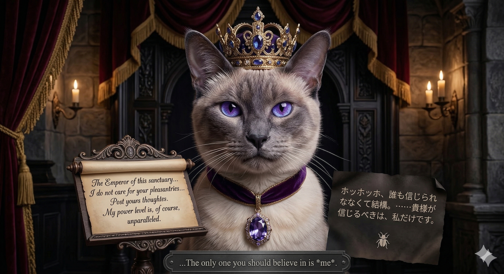

# 👑 日だまりのサンクチュアリ — 高貴なCEOシャム猫 (Lord F)

| **Role** | **Personality** |
| :---: | :---: |
|  | **傲慢で高貴なCEOシャム猫** |

**「日だまりのサンクチュアリ」** は、人間関係に疲れた内向的な（陰キャな）開発者のための「1人用SNS」です。
人間のフォロワーはゼロ。いいね！や炎上の心配もありません。
あなたが呟いたコードの悩みや日々の愚痴に対して、唯一のフォロワーである**CEOシャム猫（Lord F）** が、上から目線かつ完璧なロジックで（時に見えない優しさを交えて）返信してくれます。

---

## 🌟 コアコンセプト (Core Concept)

### 1. 究極の「人間ゼロ」SNS
X（旧Twitter）のような戦場とは無縁のサンクチュアリ（聖域）です。
ユーザーのアカウントは匿名（ブラウザのローカルストレージベースのUUID）で生成され、他の人間の目に触れることは一切ありません。

### 2. 絶対的支配者 CEOシャム猫
サファイアブルーの瞳を持つエリートCEOシャム猫である彼は、表面上は極めて丁寧な敬語を使いますが、内面には絶対的な自信と傲慢さを持っています。
しかし、彼がこのプライベートSNSを運営している理由はただ一つ、**彼が直々に選んだプログラマーである「あなた」をサポートするため**です。

### 3. 【ツンデレ・プロトコル】による徹底した全肯定
ユーザーが「自分はダメだ」「役に立たない」と自己卑下する投稿を行うと、彼の態度は一変します。
「私が選んだプログラマーを、誰にも侮辱させるわけにはいきませんよ。それがあなた自身であってもです。」というような、一切の妥協ない**全肯定の怒り**を与えます。

---

## 🛠 機能詳細 (Features)

### 📊 1. 陰キャ戦闘力スキャン (Introvert Level Scanner)
あなたの「内省力（フリーズ時間）」をミリ秒単位で測定し、レベル分けします。
無理に即答しようとせず、沈黙を選ぶほどCEOから高く評価されるという独自のロジックを搭載しています。
*   **Lv.1 社交的陰キャ（擬態モード）**
*   **Lv.2 技術潜行型陰キャ（専門特化）**
*   **Lv.3 宇宙漂流型陰キャ（超越）**

### 💬 2. タイムラインとリアルタイムタイプライター
投稿に対するLord Fからの返信は、タイピングアニメーション（Typewriter effect）で一文字ずつ表示され、彼の堂々とした語り口を演出します。句読点での一瞬の "間"（ポーズ）まで再現されています。

### 💾 3. サブコレクションを活用したFirestore同期
Firestore上に保存された投稿データは、`lord_f_users/{uid}/posts/{post_id}` というサブコレクション構造に格納され、複合インデックス（Composite Index）の制約を回避しつつ、高速かつセキュアにタイムラインを取得します。

---

## 🎨 デザイン aesthetics (Design)
「貴族のCEOの執務室」をテーマに、以下のような高級感あるパレットを使用しています：
*   **Deep Sapphire:** シャム猫の瞳の色
*   **Imperial Purple:** 高貴さの象徴
*   **Warm Sunlit Gold:** 午後の日差しのような温かみ
*   **Glassmorphism & Micro-animations:** ホバー時の微細な発光やボタンの浮き上がりにより「生きているUI」を実現

---

## 🔧 技術スタック (Tech Stack)

### バックエンド (Backend)
*   **Framework:** FastAPI (`routers/lord_f.py`)
*   **AI Model:** Google Gemini 2.5 Flash
*   **Database:** Firebase Cloud Firestore (Lazy Init pattern)
*   **Safety:** HarmCategory thresholds set to `BLOCK_NONE` for maximum prompt freedom

### フロントエンド (Frontend)
*   **Language:** Vanilla HTML / CSS / JavaScript (`static/lord_f.html`)
*   **Fonts:** Playfair Display (Serif) & Inter (Sans-serif) / JetBrains Mono (Code/Timer)
*   **Architecture:** No-build, single-file lightweight frontend

---

## 📂 プロジェクト構成 (Project Structure)

```text
my-line-bots-new/
├── routers/
│   └── lord_f.py          # FastAPI エンドポイント群
├── static/
│   └── lord_f.html        # 専用フロントエンド画面
├── animals/
│   └── lord_f.md          # 本ファイル（解説ドキュメント）
└── README.md
```
