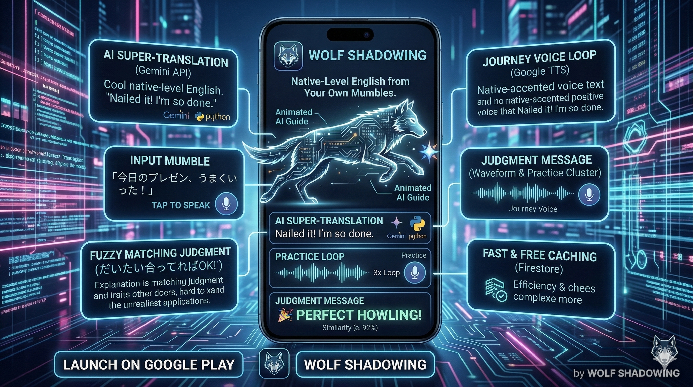
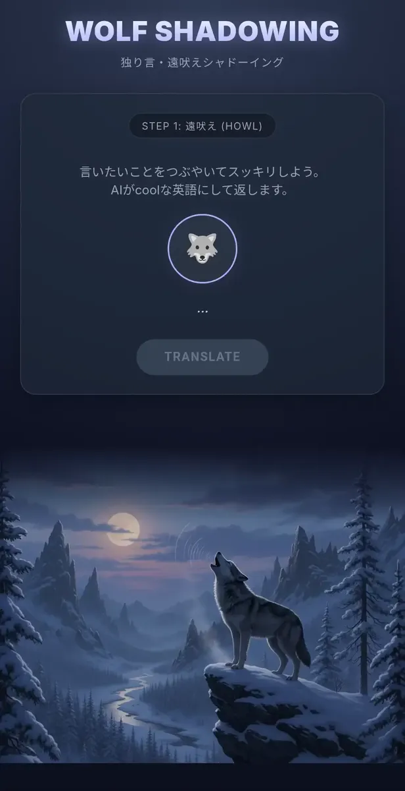

<div align="center">
  

  <h1>🐺 WOLF SHADOWING</h1>

  <p><b>英語嫌いのための独り言シャドーイングアプリ</b></p>
  <p>文法ゼロ・音で覚える。自分の本心を英語にするから、脳への定着率が段違い。</p>

  <p>
    <a href="https://play.google.com/store/apps/details?id=com.zoo.wolf">
      
    </a>
  </p>

  <p>
    <a href="https://usagi-oekaki-service-1032484155743.asia-northeast1.run.app/static/wolf.html">
        
    </a>
    <a href="https://zenn.dev/miki_mini/articles/c3191ee6a2d82a">
        
    </a>
  </p>

  <p>
    
    
    
  </p>
</div>

---

> **初心者がゼロからGoogle Playリリースの壁を突破した、魂の1作です。**
> 👉 [開発の裏話（Zenn記事）はこちら](https://zenn.dev/miki_mini/articles/c3191ee6a2d82a)

## ✨ EXPERIENCE

<div align="center">
  
</div>

<br>

### 🎯 3つのステップで覚醒する

1. 🎤 **SPEAK**: マイクボタンをタップ → 日本語で本音を叫ぶ！
2. 🔄 **TRANSLATE**: 瞬時にAIが超クールなネイティブ英語に変換＆3回ループ再生
3. 🐺 **HOWL**: マイクに向かって一緒に遠吠え（シャドーイング）！

> 🗣️ **USER:** 「今日のプレゼン、めっちゃうまくいった！最高の気分！」
> 🤖 **AI:** "Today's presentation went incredibly well! I'm feeling absolutely amazing!"
> 🔈 *(3回リピート再生)*
> 🗣️ **USER:** 「トゥデイズ プレゼンテーション...」
> 🎉 **判定:** Perfect Howling! (Similarity: 92%)

---

## 🔥 FEATURES

### 🧠 リアルな感情を英語に
「教科書英語」はもう終わり。あなたの日本語の愚痴や喜びを、Gemini AIがネイティブが実際に使う自然でクールな英語に超訳します。本心を英語にするから、脳への定着率が段違い！

### 👂 耳で覚える自動ループ
ワンタップでネイティブの音声を完璧な発音で3回リピート再生。脳に直接インストールするように、音で英語を吸収します。

### 🐺 あいまいシャドーイング判定
完璧じゃなくても大丈夫。レーベンシュタイン距離を用いた類似度判定により、85%以上の類似度でOK！自信をつけて次のステップへ進めます。

### ⚡ 爆速＆低コストなキャッシュ
一度翻訳した言葉はFirestoreにキャッシュ。2回目以降はAPIを叩かず即座に返却されるため、お財布にも優しく超高速です。

---

## 🛠️ TECH STACK

**Frontend**
- Vanilla JavaScript / Web Speech API (音声認識) / CSS3 (ダークモードUI)

**Backend**
- Python 3.9+ / FastAPI / Vertex AI Gemini 2.5 Flash / Google Cloud Text-to-Speech (Journey Voice) / Firestore

---

## 🚀 GET STARTED

### 1. Repository Setup

```bash
git clone https://github.com/your-username/wolf-shadowing.git
cd wolf-shadowing
python -m venv venv
source venv/bin/activate  # Windows: venv\\Scripts\\activate
pip install -r requirements.txt
```

### 2. Google Cloud Authentication

```bash
export GOOGLE_APPLICATION_CREDENTIALS="path/to/your-service-account-key.json"
# or
gcloud auth application-default login
```

### 3. Environment Variables

```bash
cp .env.example .env
```
*(Edit `.env` to add your GCP Project ID and Firestore collection names)*

### 4. Run Server

```bash
uvicorn main:app --reload
```
Open `http://localhost:8000` in your browser.

---

## 🧠 ENGINEERING HIGHLIGHTS

### 1. レーベンシュタイン距離による「優しい判定」

完璧な発音を求めすぎず、モチベーションを維持する設計。

```javascript
// 85%以上の類似度で「Perfect Howling!」
if (similarity >= 0.85) { ... }
```
- 「meeting」を「meetin」と発音しても合格（類似度92%）

### 2. プロンプトエンジニアリング

「文法だけ正しい不自然な英語」を排除し、完全な文でありながらカジュアルな英語を生成。

```python
prompt = \"\"\"
- 常に完全な文（主語＋動詞）にする。名詞句や不定詞だけの文は禁止。
- 直訳ではなく、英語話者が同じ感情・状況で実際に口にする表現にする。
...
\"\"\"
```
- ❌ "What movie to watch?"
- ⭕ "What movie should I watch?"

---

## 📝 ROADMAP

- [ ] 履歴機能（過去に遠吠えした英語を復習）
- [ ] スピーキングレベル判定
- [ ] PWA化（アプリとしてインストール可能に）
- [ ] 多言語対応（英語以外の言語も学習可能に）

---

<div align="center">
  <p>Released under the <a href="LICENSE">MIT License</a>.</p>
  <p>Created with 🐺 by <b>miki-mini</b></p>
</div>