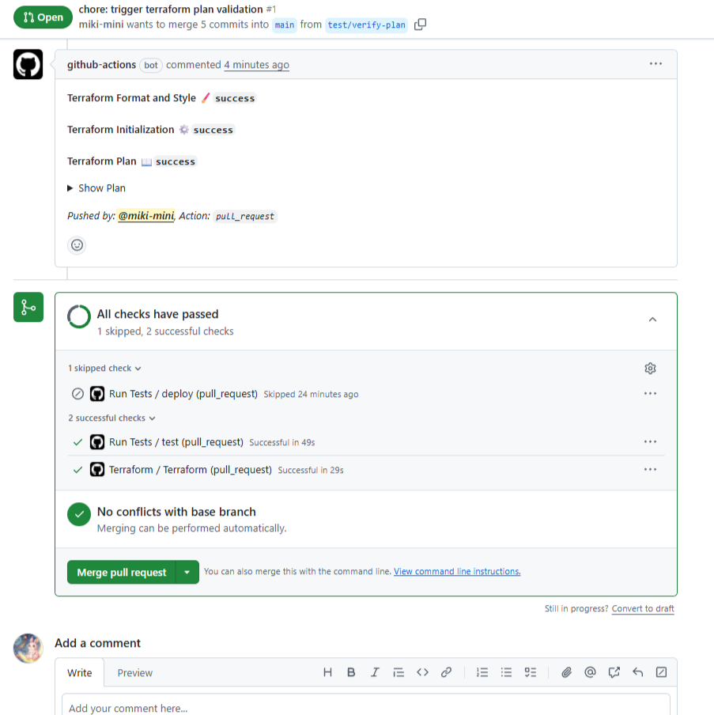

# 🚀 Terraform for My AI ZOO Portal

このディレクトリには、Google Cloudインフラストラクチャを管理するためのTerraform設定ファイルが含まれています。

**手動で何時間もかかった設定が、`terraform apply` 一発で完了します。**

## 📖 関連記事

詳しい解説はこちら：
- [Terraform × GCP｜手動4時間を3分に短縮。個人開発を加速させる「永続的インフラ」の作り方🚀](https://zenn.dev/miki_mini/articles/091e7cef00c704)


## 🗺️ システム構成図

```mermaid
%%{init: {'theme': 'base', 'themeVariables': { 'primaryColor': '#e1f5fe', 'edgeLabelBackground':'#ffffff', 'tertiaryColor': '#fff'}}}%%
graph TD
    %% 外部サービス
    User[End User]
    Line[LINE Platform]
    AI[External AI API <br/> (OpenAI/Gemini)]
    Dev[Developer]
    GH[GitHub Repository]
    GHA[GitHub Actions]

    subgraph GCP[Google Cloud Project]
        direction TB

        %% インフラ管理
        Backend[(GCS Backend <br/> (tfstate))]

        %% 認証・セキュリティ
        WIF[Workload Identity <br/> Federation]
        IAM[IAM <br/> (最小権限)]
        Secrets[[Secret Manager <br/> (API Keys)]]

        %% アプリケーション基盤
        Registry[(Artifact Registry <br/> (Docker Image))]
        Run[Cloud Run <br/> (Python LINE Bot)]

        %% インフラ構築の流れ
        Dev -.->|1. terraform apply| Backend
        Dev -.->|1. terraform apply| GCP

    end

    %% CI/CDの流れ
    Dev -->|2. git push| GH
    GH -->|3. trigger| GHA
    GHA -->|4. 認証 (Keyless)| WIF
    WIF -->|5. 短期クレデンシャル生成| IAM
    GHA -->|6. Push Image| Registry
    GHA -->|7. Deploy| Run

    %% アプリケーションの流れ
    User <-->|メッセージ| Line
    Line <-->|Webhook| Run
    Run -.->|8. Get Secrets| Secrets
    Run <-->|9. AI解析| AI

    
## 🎯 このTerraformで構築されるもの

- ✅ **Artifact Registry**: Dockerイメージの保存
- ✅ **Cloud Run**: LINE Botの実行環境
- ✅ **Secret Manager**: APIキーなどの秘密情報管理
- ✅ **Workload Identity Federation**: GitHub Actionsからの安全な認証
- ✅ **IAM**: 最小権限の原則に基づく権限設定
- ✅ **GCS Backend**: Terraformの状態管理

## 📁 ファイル構成

| ファイル | 役割 | 対応するgcloudコマンド |
|---------|------|---------------------|
| `main.tf` | プロバイダー設定、基本設定 | - |
| `backend.tf` | State保存先（GCS） | - |
| `variables.tf` | 変数定義 | - |
| `artifact_registry.tf` | Dockerレジストリ | `gcloud artifacts repositories create` |
| `cloud_run.tf` | Cloud Runサービス | `gcloud run deploy` |
| `secrets.tf` | Secret Manager | `gcloud secrets create` |
| `iam.tf` | WIF、権限設定 | `gcloud iam ...` |

## 🚀 クイックスタート

### 前提条件

- [Terraform](https://developer.hashicorp.com/terraform/install) (>= 1.5.0)
- [Google Cloud SDK](https://cloud.google.com/sdk/docs/install)
- GCPプロジェクトとアクセス権限

### 1. 認証

```bash
gcloud auth application-default login
```

### 2. 変数ファイルの作成

```bash
cd terraform
cp terraform.tfvars.example terraform.tfvars
```

`terraform.tfvars` を編集：

```hcl
project_id        = "your-project-id"
region            = "asia-northeast1"
service_name      = "usagi-oekaki-service"
github_repository = "your-username/your-repo"
```

### 3. GCSバケット作成（State保存用）

```bash
PROJECT_ID="your-project-id"
BUCKET_NAME="${PROJECT_ID}-terraform-state"

# バケット作成
gsutil mb -l asia-northeast1 gs://${BUCKET_NAME}

# バージョニング有効化
gsutil versioning set on gs://${BUCKET_NAME}
```

`backend.tf` のバケット名を更新：

```hcl
terraform {
  backend "gcs" {
    bucket = "your-project-id-terraform-state"
    prefix = "terraform/state"
  }
}
```

### 4. 初期化

```bash
terraform init
```

### 5. 実行

```bash
# 変更内容の確認
terraform plan

# 実行
terraform apply
```

## 🤖 GitHub Actionsとの連携

このTerraformは**インフラの土台**を作ります。
日々のアプリデプロイは `.github/workflows/deploy.yml` が自動で行います。

### インフラの自動化（Terraform）

`.github/workflows/terraform.yml` により、`terraform/` ディレクトリの変更を検知して自動実行：

1. **Pull Request時**: `terraform plan` を実行してPRにコメント
2. **mainマージ時**: `terraform apply` を自動実行

### 役割分担

```
Terraform（このディレクトリ）:
  └─ インフラの構築・変更
     ├─ Artifact Registry
     ├─ Cloud Run
     ├─ Secret Manager
     └─ IAM/WIF

GitHub Actions（.github/workflows/deploy.yml）:
  └─ アプリのデプロイ
     ├─ テスト
     ├─ Dockerビルド
     └─ Cloud Runへのデプロイ
```

## 📸 DevOps in Action

Pull Requestを作成すると、Botが自動的に変更内容（Plan）をコメントしてくれます。


## ⚠️ トラブルシューティング (重要)

### 1. "API not enabled" エラーが出る場合
CI/CDを実行するには、以下のAPIを有効にする必要があります。これを忘れると `Terraform` が動きません。

- **Cloud Resource Manager API** (`cloudresourcemanager.googleapis.com`)
- **Service Usage API** (`serviceusage.googleapis.com`)

[Google Cloud Console > APIs & Services > Library](https://console.cloud.google.com/apis/library) から検索して有効化してください。

### 2. Secret Managerのシークレット作成

Terraformは**シークレットの箱**だけを作ります。実際の値は別途設定が必要です：

```bash
# LINE Channel Access Token
echo -n "YOUR_TOKEN" | gcloud secrets versions add LINE_CHANNEL_ACCESS_TOKEN --data-file=-

# LINE Channel Secret
echo -n "YOUR_SECRET" | gcloud secrets versions add LINE_CHANNEL_SECRET --data-file=-
```

### GitHub Secretsの設定

GitHub Actionsで使用するため、以下をGitHub Secretsに登録：

```bash
# WIF Provider
terraform output -raw workload_identity_provider

# Service Account Email
terraform output -raw github_actions_sa_email
```

GitHub Settings > Secrets and variables > Actions:
- `GCP_WORKLOAD_IDENTITY_PROVIDER`: 上記のWIF Provider
- `GCP_SERVICE_ACCOUNT`: 上記のService Account Email
- `GCP_PROJECT_ID`: あなたのプロジェクトID

## 🔒 セキュリティ

### 秘密情報の管理

- ❌ **絶対にコミットしないもの**:
  - `terraform.tfvars`
  - `*.tfstate`
  - `*.tfstate.backup`
  - サービスアカウントキー（.json）

- ✅ **安全な管理方法**:
  - Secret Manager に保存
  - GCS Backend で State を暗号化
  - WIF でキーレス認証

### .gitignore

```gitignore
# Terraform
*.tfstate
*.tfstate.*
.terraform/
terraform.tfvars

# Secrets
*.json
!terraform.tfvars.example
```

## 📊 便利なコマンド

```bash
# 現在の状態確認
terraform show

# リソース一覧
terraform state list

# 特定リソースの詳細
terraform state show google_cloud_run_v2_service.voidoll_bot

# 出力値の確認
terraform output

# フォーマット
terraform fmt -recursive

# 検証
terraform validate

# リソースの削除（注意！）
terraform destroy
```

## 🔄 更新フロー

### ローカルで実行する場合

```bash
# 1. ファイル編集
vim cloud_run.tf

# 2. 確認
terraform plan

# 3. 適用
terraform apply
```

### GitHub Actionsで実行する場合（推奨）

```bash
# 1. ブランチ作成
git checkout -b feature/update-memory

# 2. ファイル編集
vim terraform/cloud_run.tf

# 3. コミット & プッシュ
git add .
git commit -m "Increase Cloud Run memory to 2Gi"
git push origin feature/update-memory

# 4. PRを開く
# → GitHub Actions が自動で terraform plan を実行
# → Plan結果がPRにコメントされる

# 5. レビュー後、マージ
# → GitHub Actions が自動で terraform apply を実行
```

## 🆘 トラブルシューティング

### State がロックされた

```bash
# ロックの強制解除（注意！）
terraform force-unlock LOCK_ID
```

### 権限エラー

```bash
# 現在の認証情報確認
gcloud auth list

# 必要な権限
# - Editor または Owner
# - Project IAM Admin（IAM設定を変更する場合）
```

### State の移行（ローカル → GCS）

```bash
terraform init -migrate-state
```

## 📚 参考資料

- [Terraform Google Provider Documentation](https://registry.terraform.io/providers/hashicorp/google/latest/docs)
- [Google Cloud Best Practices](https://cloud.google.com/architecture/framework)
- [Workload Identity Federation](https://cloud.google.com/iam/docs/workload-identity-federation)


---

**「一度の苦労を永続的な資産に」** 🚀